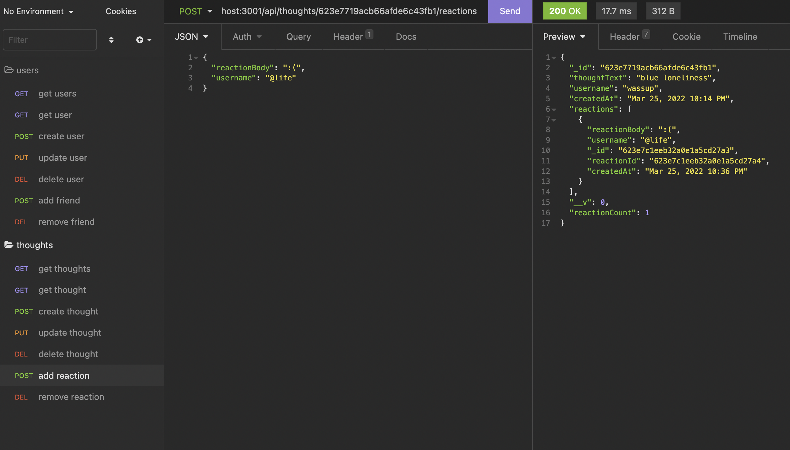

# Social Network API

This application demonstrates an API using MongoDB. With a social network framework, users can manuever API routes to post thoughts, reactions, add/remove friends, create user accounts, and more.

## Installation

Clone this repository to your local, run `npm i` to install dependencies, and then `npm start` or `nodemon server.js` to start the server.

## Usage

After the server is started, run Insomnia to get a feel for all of the routes.

Get all thoughts!

Create user!

Add friend to user!

Add reaction to thought!

Example routes in Insomnia for reference :)

[Here](https://drive.google.com/file/d/1H2Ep89nonm3sAzOYcU2kDUA4TFYipySV/view) is a walkthrough video for the user routes.

[Here](https://drive.google.com/file/d/1kY3vK4hlN7M9kIZhd3cmnNlDIkS9kghK/view) is a walkthrough video for the thought routes.

## Credits

This application was made using MongoDB, Insomnia, Express, Mongoose, and Moment.

## License

Copyright (c) 2022 stardust productions.

MIT License